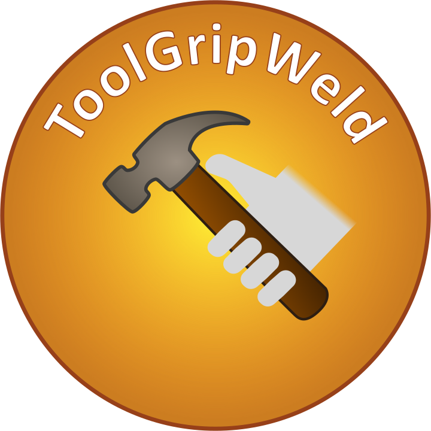

# ToolGripWeld

A lightweight Roblox Studio plugin for calculating and setting Tool.Grip from a selected Tool and character rig, with automatic R6/R15 grip handling.
https://create.roblox.com/store/asset/115157469748620/ToolGripWeld
